# Game Churn Prediction AI - System Architecture

This document contains the system architecture diagram for the Game Churn Prediction AI project, illustrating the end-to-end Machine Learning pipeline and Streamlit application flow.

## Architecture Diagram (Mermaid)

```mermaid
graph LR
    %% Data Layer
    subgraph Data_Layer [Data Layer]
        A[(Raw CSV Dataset<br/>Kaggle Gaming Behavior)] --> B[(Cleaned Dataset)]
    end

    %% Data Processing Layer
    subgraph Processing_Layer [Data Processing Layer]
        B --> C[Missing Value Handling]
        C --> D[Duplicate Removal]
        D --> E[Feature Engineering]
        E --> F[One-hot Encoding]
    end

    %% ML Layer
    subgraph ML_Layer [ML Layer]
        F --> G[Train/Test Split]
        G --> H[Random Forest Model<br/>Main]
        G --> I[Logistic Regression<br/>Baseline]
        H --> J[Model Evaluation]
        I --> J
    end

    %% Model Storage
    subgraph Storage_Layer [Model Storage]
        J --> K[(churn_model.pkl)]
        J --> L[(model_features.pkl)]
    end

    %% Application Layer
    subgraph App_Layer [Application Layer]
        M{Streamlit Web UI} --> N[CSV Upload]
        N --> O[Prediction Engine]
        O --> P[Feature Importance Visualization]
        O --> Q[Download Predictions]
    end

    %% Cross-Layer Connections
    K -.->|Loads Trained Model| O
    L -.->|Loads Feature List| O

    %% Output Layer
    subgraph Output_Layer [Output Layer]
        O --> R[Churn Probability]
        O --> S[Risk Level<br/>Low/Medium/High]
        P --> T[Insights Dashboard]
    end
    
    %% Styling Classes
    classDef default fill:#ffffff,stroke:#333,stroke-width:1px,color:#333;
    classDef storage fill:#e1f5fe,stroke:#0288d1,stroke-width:2px,color:#000;
    classDef process fill:#fff3e0,stroke:#f57c00,stroke-width:2px,color:#000;
    classDef model fill:#e8f5e9,stroke:#388e3c,stroke-width:2px,color:#000;
    classDef app fill:#f3e5f5,stroke:#7b1fa2,stroke-width:2px,color:#000;
    classDef output fill:#ffebee,stroke:#d32f2f,stroke-width:2px,color:#000;

    class A,B,K,L storage;
    class C,D,E,F process;
    class G,H,I,J model;
    class M,N,O,P,Q app;
    class R,S,T output;
```

